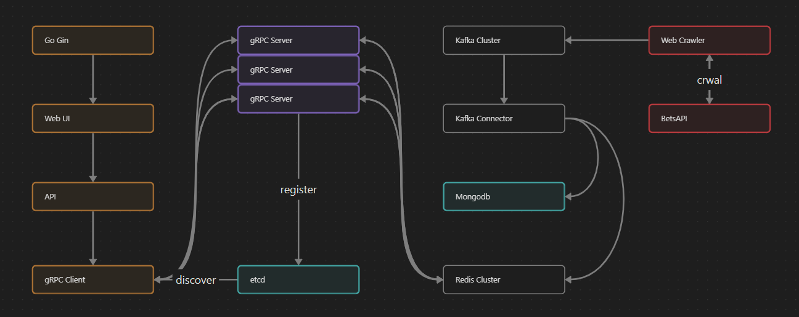
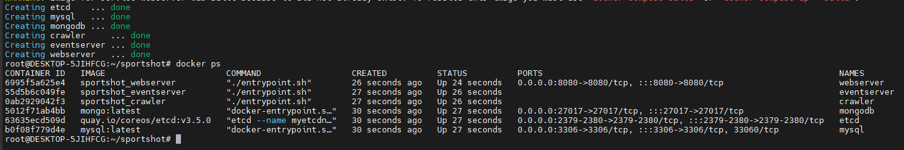
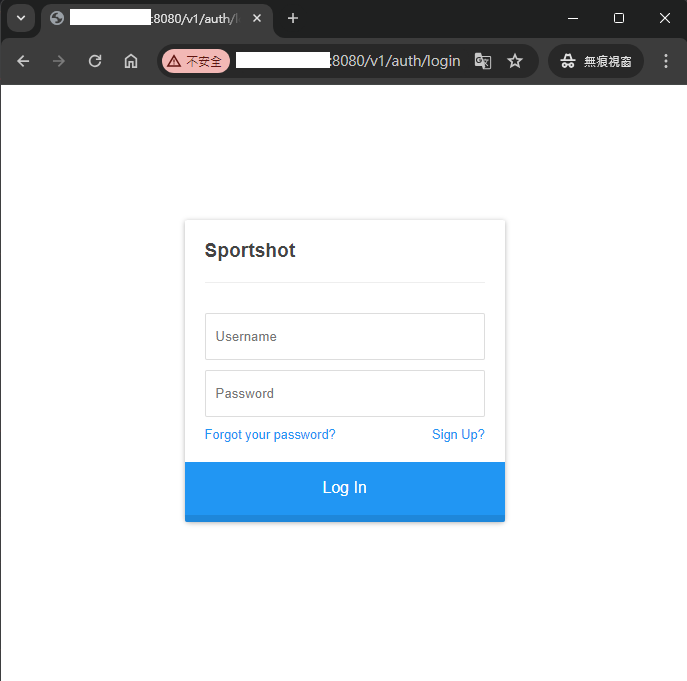
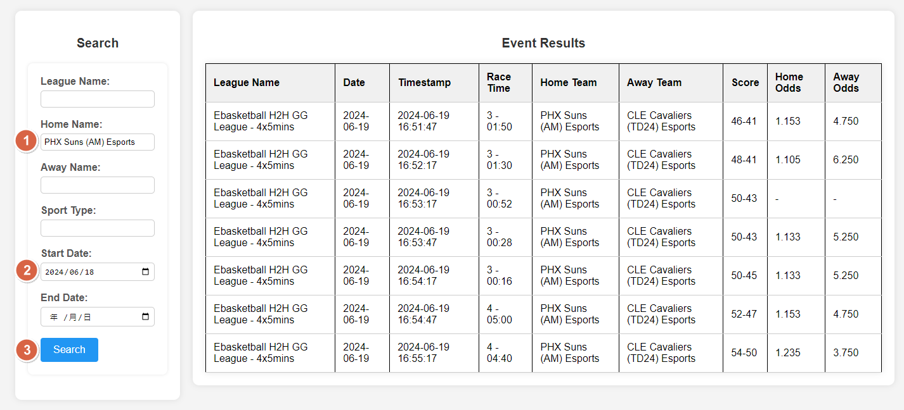
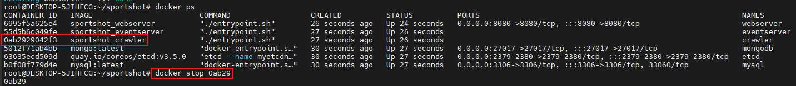
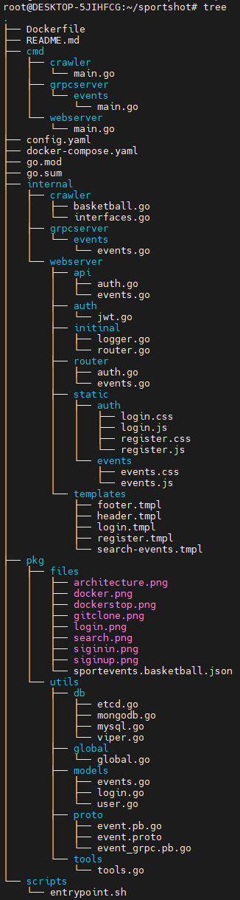

# Introduction

Sportshot is a sports odds scanning tool that automatically crawls and retrieves sports betting odds. It's designed to
be easy to use, enabling users to quickly access and track the historical data of the odds they're interested in. This
tool helps you keep track of changes in sports odds efficiently and effectively.

## Architecture Reference



## Getting started
### Pre required on your device
* `Linux` Ubuntu 20.04.4 LTS
* `Git` 2.25.1
* `Docker` 26.1.3
* `Docker Compose` 2.27.0

### 1. Git
```
git clone https://github.com/hugohu0224/sportshot.git
```

### 2. Docker Compose
```
cd sportshot
docker-compose up -d
```

### 3. Check server state
```
docker ps -a
```


### 4. Login and Register
* Please click "Sign Up" to register for the first time.
```
http://localhost:8080/v1/auth/login
```


### 5. Start to search sport events


## Take care
The default speed of crawler is 30 seconds, set in config.yaml.
Sportshot has not been optimized for anti-crawler, if the crawler is too many times or too fast, 
it will be anti-crawler, if it is only for test, please remember to use docker stop to shut down the crawler, 
in order to avoid the IP being blocked by BetsAPI.


## Project Structure


## Todo List
### Crawler

* :white_check_mark: Implement basketball crawler.
* :white_check_mark: Persist the crawled data to MongoDB.
* :x: Remove spaces or symbols from the team names.

### WebServer

* :white_check_mark: Implement the get method to receive user parameters.
* :white_check_mark: Implement the accessing process the event server via the grpc client.
* :white_check_mark: Implement user registration function to make the service available to others(by local).
* :white_check_mark: Implement JWT to make sure that the user is allowed to access a specific page.

### WebUI

* :white_check_mark: Implement the front-end page for odds searching.
* :white_check_mark: Implement a button to control the on/off of the crawler.
* :black_square_button: Made the front-end webpage to display the crawled odds in real time.

### EventServer(grpc)

* :white_check_mark: Implement the interaction between grpc server and MongoDB.
* :white_check_mark: Receives parameters from the API to filter the data.
* :white_check_mark: Implement gRPC naming and discovery using etcd.
* :white_check_mark: Implement etcd load balancer.
* :x: Implement the distributed crawler structure.

### DbServer

* :white_check_mark: MongoDB for web crawler.
* :white_check_mark: etcd for grpc.
* :white_check_mark: MySQL for user login authentication.
* :x: Redis.
* :x: Kafka.

### Others

* :white_check_mark: Implement One-click activation of all services by docker-compose.
* :white_check_mark: Implement the services splitability.
* :white_check_mark: Enhance the maintainability of the config file.

### Emoji meaning

* :black_square_button: Not finish yet.
* :white_check_mark: Finished.
* :large_blue_diamond: Might be added.
* :x: Cancel
